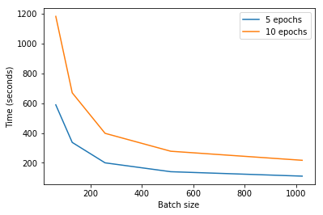

# Keras on MXNet

### Table of contents
1. [Topic](#topic)
2. [Goal](#goal)
3. [Scenarios](#scenarios)
4. [What is Keras?](#what_is_keras)
5. [What is MXNet?](#what_is_mxnet)
6. [Project structure](#project_structure)
7. [Hardware](#hardware)
8. [Result](#result)

### Topic 

To use MXNet as a backend with Keras

### Goal 

Generate results and conclusions that describe the use of MXNet as a backend with Keras in the following cases:

* CPU
* GPU
* Multi-GPU

### Scenarios 

* Convolutional NN with LeNet and MNIST
* Recurrent NN with IMDB reviews

### What is Keras? 

>Keras is a high-level neural networks API, written in Python and capable of
running on top of TensorFlow, CNTK, or Theano. It was developed with a focus on
enabling fast experimentation. Being able to go from idea to result with the
least possible delay is key to doing good research.

The official description of Keras does not include MXNet. **Today is not possible
to use MXNet with Keras officially**. However, you can find a [**fork**](https://github.com/dmlc/keras)
on GitHub of Keras 1.2.2 supporting it.

### What is MXNet? 

>MXNet is an modern open-source deep learning framework used to train,
and deploy deep neural networks. It is scalable, allowing for fast model training,
and supports a flexible programming model and multiple languages.

### Project structure 

You can find two projects:

* **lenet-mnist**: Contains an implementation of LeNet architecture (CNN) with MNIST.
* **rnn-imdb**: Contains an implementation of a RNN with IMDB reviews.

Moreover, in the project root exists the 'requirement' folder with three bash scripts containing the software needed to run both projects, depending on which hardware you have.

Inside both lenet-mnist and rnn-imdb projects you can find scripts that run the neural networks n times with different batch sizes and epochs.

### Hardware 

AWS EC2 instances:

* c4.xlarge (CPU)
* p2.xlarge (GPU)
* p2.8xlarge (Multi-GPU)

### Result 

The output is located inside 'output' folder. It contains a txt file with the following fields comma-separated:

* Batch size
* Epochs
* Loss
* Accuracy
* Time (seconds)

The final results have been moved to 'result' folder where you can find 'cpu', 'gpu' and 'multigpu' folders.

#### CNN LeNet MNIST  

- **CPU:** It is possible to execute the whole script. However, the time needed to complete the executions is very high.

- **GPU:** The time needed to complete the script decrease critically even with 60 epochs.

- **Multi-GPU:** Using 8 GPUs NVDIA K80 is very expensive and the main difference with just one GPU is the execution time with high batch size. The more batch size you choose, the less time you need.

#### RNN IMDB reviews 

- **CPU:** It is not possible to run the RNN over CPU. Even with very low epochs the CPU can not finish the execution in a reasonable time.

- **GPU:** Despite the complexity of this kind of RNN, one GPU can execute it but the time needed to complete the whole script is much higher than CNN LeNet.

- **Multi-GPU:** As you can see, the multi-GPU execution is very similar to GPU. The parallelization have sense if the amount of epochs is very high. 

