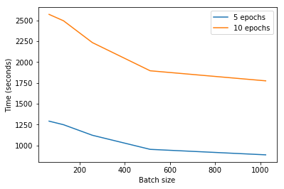
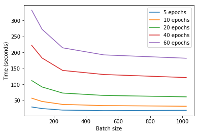
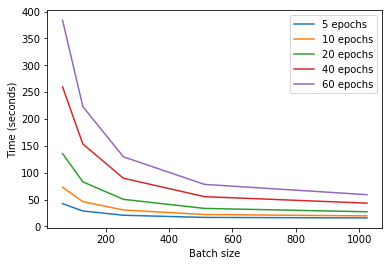
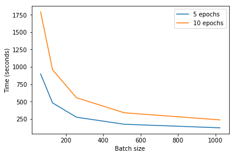

# Keras on MXNet

### Table of contents
1. [Topic](#topic)
2. [Goal](#goal)
3. [Scenarios](#scenarios)
4. [What is Keras?](#what_is_keras)
5. [What is MXNet?](#what_is_mxnet)
6. [Project structure](#project_structure)
7. [Hardware](#hardware)
8. [Result](#result)
  1. [CNN LeNet MNIST](#result_lenet)
  2. [RNN IMDB reviews](#result_rnn_imdb)
9. [Conclusion](#conclusion)

### Topic 

To use MXNet as a backend with Keras

### Goal 

Generate results and conclusions that describe the use of MXNet as a backend with Keras in the following cases:

* CPU
* GPU
* Multi-GPU

### Scenarios 

* Convolutional NN with LeNet and MNIST

### What is Keras? 

>Keras is a high-level neural networks API, written in Python and capable of
running on top of TensorFlow, CNTK, or Theano. It was developed with a focus on
enabling fast experimentation. Being able to go from idea to result with the
least possible delay is key to doing good research.

The official description of Keras does not include MXNet. **Today is not possible
to use MXNet with Keras officially**. However, you can find a [**fork**](https://github.com/dmlc/keras)
on GitHub of Keras 1.2.2 supporting it.

### What is MXNet? 

>MXNet is an modern open-source deep learning framework used to train,
and deploy deep neural networks. It is scalable, allowing for fast model training,
and supports a flexible programming model and multiple languages.

### Project structure 

You can find two projects:

* **lenet-mnist**: Contains an implementation of LeNet architecture (CNN) with MNIST.
* **rnn-imdb**: Contains an implementation of a RNN with IMDB reviews.

Moreover, in the project root exists the 'requirement' folder with three bash scripts containing the software needed to run both projects, depending on which hardware you have.

Inside both lenet-mnist and rnn-imdb projects you can find scripts that run the neural networks n times with different batch sizes and epochs.

### Hardware 

AWS EC2 instances:

* c4.xlarge (CPU)
* p2.8xlarge (GPU and Multi-GPU)

### Result 

The output is located inside 'output' folder. It contains a txt file with the following fields comma-separated:

* Batch size
* Epochs
* Loss
* Accuracy
* Time (seconds)

The final results have been moved to 'result' folder where you can find 'cpu', 'gpu' and 'multigpu' folders.

| infrastructure | model | script | batch size | gpus | Accuracy (validation) | Epochs | Training time (s/epoch)
| --- | --- | --- | --- | --- | --- | --- | ---
| 1 | lenet | keras_mxnet_lenet | 64 | 0 | 0.991 | 12 | 255.7 (235 samples/s) 
| 1 | lenet | keras_mxnet_lenet | 128 | 0 | 0.988 | 12 | 263.2 (228 samples/s)
| 1 | lenet | keras_mxnet_lenet | 256 | 0 | 0.987 | 12 | 232.4 (258 samples/s)
| 1 | lenet | keras_mxnet_lenet | 512 | 0 | 0.986 | 12 | 212.4 (283 samples/s)
| 1 | lenet | keras_mxnet_lenet | 64 | 1 | 0.982 | 12 | 5.9 (10203 samples/s) 
| 1 | lenet | keras_mxnet_lenet | 128 | 1 | 0.980 | 12 | 4.9 (12285 samples/s)
| 1 | lenet | keras_mxnet_lenet | 256 | 1 | 0.956 | 12 | 3.9 (15435 samples/s)
| 1 | lenet | keras_mxnet_lenet | 512 | 1 | 0.959 | 12 | 3.6 (16721 samples/s)
| 1 | lenet | keras_mxnet_lenet | 1024 | 1 | 0.929 | 12 | 3.3 (18242 samples/s)
| 1 | lenet | keras_mxnet_lenet | 2048 | 1 | 0.890 | 12 | 3.2 (18812 samples/s) 
| 1 | lenet | keras_mxnet_lenet | 4096 | 1 | 0.842 | 12 | 3.2 (18812 samples/s)
| 1 | lenet | keras_mxnet_lenet | 64 | 4 | 0.989 | 12 | 4.9 (12285 samples/s) 
| 1 | lenet | keras_mxnet_lenet | 128 | 4 | 0.986 | 12 | 2.6 (23153 samples/s)
| 1 | lenet | keras_mxnet_lenet | 256 | 4 | 0.985 | 12 | 1.8 (33443 samples/s)
| 1 | lenet | keras_mxnet_lenet | 512 | 4 | 0.978 | 12 | 1.4 (42999 samples/s)
| 1 | lenet | keras_mxnet_lenet | 1024 | 4 | 0.971 | 12 | 1.1 (54726 samples/s)
| 1 | lenet | keras_mxnet_lenet | 2048 | 4 | 0.955 | 12 | 1.0 (60199 samples/s) 
| 1 | lenet | keras_mxnet_lenet | 4096 | 4 | 0.929 | 12 | 1.3 (46306 samples/s)  
| 1 | lenet | keras_mxnet_lenet | 64 | 8 | 0.990 | 12 | 6.9 (8724 samples/s) 
| 1 | lenet | keras_mxnet_lenet | 128 | 8 | 0.989 | 12 | 3.9 (15435 samples/s)
| 1 | lenet | keras_mxnet_lenet | 256 | 8 | 0.983 | 12 | 2.2 (27363 samples/s)
| 1 | lenet | keras_mxnet_lenet | 512 | 8 | 0.985 | 12 | 1.2 (50165 samples/s)
| 1 | lenet | keras_mxnet_lenet | 1024 | 8 | 0.978 | 12 | 0.85 (70822 samples/s)
| 1 | lenet | keras_mxnet_lenet | 2048 | 8 | 0.969 | 12 | 0.83 (72528 samples/s) 
| 1 | lenet | keras_mxnet_lenet | 4096 | 8 | 0.949 | 12 | 0.67 (89849 samples/s) 
| 1 | lenet | keras_mxnet_lenet_optimized | 64 | 1 | 0.990 | 12 | 5.9 (10185 samples/s) 
| 1 | lenet | keras_mxnet_lenet_optimized | 128 | 1 | 0.989 | 12 | 4.9 (12285 samples/s)
| 1 | lenet | keras_mxnet_lenet_optimized | 256 | 1 | 0.983 | 12 | 3.9 (15435 samples/s)
| 1 | lenet | keras_mxnet_lenet_optimized | 512 | 1 | 0.977 | 12 | 3.6 (16721 samples/s)
| 1 | lenet | keras_mxnet_lenet_optimized | 1024 | 1 | 0.966 | 12 | 3.3 (18242 samples/s)
| 1 | lenet | keras_mxnet_lenet_optimized | 2048 | 1 | 0.942 | 12 | 3.2 (18812 samples/s) 
| 1 | lenet | keras_mxnet_lenet_optimized | 4096 | 1 | 0.918 | 12 | 3.1 (19419 samples/s)
| 1 | lenet | keras_mxnet_lenet_optimized | 64 | 4 | 0.990 | 12 | 5.1 (11803 samples/s) 
| 1 | lenet | keras_mxnet_lenet_optimized | 128 | 4 | 0.990 | 12 | 2.6 (23153 samples/s)
| 1 | lenet | keras_mxnet_lenet_optimized | 256 | 4 | 0.990 | 12 | 1.8 (33443 samples/s)
| 1 | lenet | keras_mxnet_lenet_optimized | 512 | 4 | 0.987 | 12 | 1.4 (42999 samples/s)
| 1 | lenet | keras_mxnet_lenet_optimized | 1024 | 4 | 0.985 | 12 | 1.1 (54726 samples/s)
| 1 | lenet | keras_mxnet_lenet_optimized | 2048 | 4 | 0.978 | 12 | 1.4 (42999 samples/s) 
| 1 | lenet | keras_mxnet_lenet_optimized | 4096 | 4 | 0.965 | 12 | 1.5 (40132 samples/s)  
| 1 | lenet | keras_mxnet_lenet_optimized (LR=0.01) | 64 | 8 | 0.991 | 12 | 7.2 (8360 samples/s) 
| 1 | lenet | keras_mxnet_lenet_optimized (LR=0.01) | 128 | 8 | 0.990 | 12 | 3.8 (15841 samples/s)
| 1 | lenet | keras_mxnet_lenet_optimized (LR=0.01) | 256 | 8 | 0.988 | 12 | 2.2 (27363 samples/s)
| 1 | lenet | keras_mxnet_lenet_optimized (LR=0.01) | 512 | 8 | 0.981 | 12 | 1.2 (50165 samples/s)
| 1 | lenet | keras_mxnet_lenet_optimized (LR=0.01) | 1024 | 8 | 0.976 | 12 | 0.9 (66887 samples/s)
| 1 | lenet | keras_mxnet_lenet_optimized (LR=0.01) | 2048 | 8 | 0.958 | 12 | 0.8 (75248 samples/s) 
| 1 | lenet | keras_mxnet_lenet_optimized (LR=0.01) | 4096 | 8 | 0.934 | 12 | 0.7 (85998 samples/s) 
| 1 | lenet | mxnet_lenet_official_sample | 64 | 1 | 0.991 | 12 | 2.8 (21428 samples/s) 
| 1 | lenet | mxnet_lenet_official_sample | 128 | 1 | 0.991 | 12 | 2.2 (27272 samples/s)
| 1 | lenet | mxnet_lenet_official_sample | 256 | 1 | 0.990 | 12 | 1.8 (33333 samples/s)
| 1 | lenet | mxnet_lenet_official_sample | 512 | 1 | 0.990 | 12 | 1.7 (35294 samples/s)
| 1 | lenet | mxnet_lenet_official_sample | 1024 | 1 | 0.989 | 12 | 1.6 (37500 samples/s)
| 1 | lenet | mxnet_lenet_official_sample | 2048 | 1 | 0.987 | 12 | 1.6 (37500 samples/s) 
| 1 | lenet | mxnet_lenet_official_sample | 4096 | 1 | 0.978 | 12 | 1.5 (40000 samples/s)
| 1 | lenet | mxnet_lenet_official_sample | 64 | 4 | 0.991 | 12 | 2.5 (24000 samples/s) 
| 1 | lenet | mxnet_lenet_official_sample | 128 | 4 | 0.991 | 12 | 1.2 (50000 samples/s)
| 1 | lenet | mxnet_lenet_official_sample | 256 | 4 | 0.991 | 12 | 0.8 (75000 samples/s)
| 1 | lenet | mxnet_lenet_official_sample | 512 | 4 | 0.991 | 12 | 0.6 (100000 samples/s)
| 1 | lenet | mxnet_lenet_official_sample | 1024 | 4 | 0.989 | 12 | 0.5 (120000 samples/s)
| 1 | lenet | mxnet_lenet_official_sample | 2048 | 4 | 0.986 | 12 | 0.4 (150000 samples/s) 
| 1 | lenet | mxnet_lenet_official_sample | 4096 | 4 | 0.978 | 12 | 0.4 (150000 samples/s)  
| 1 | lenet | mxnet_lenet_official_sample | 64 | 8 | 0.992 | 12 | 4.5 (13333 samples/s) 
| 1 | lenet | mxnet_lenet_official_sample | 128 | 8 | 0.990 | 12 | 2.3 (26086 samples/s)
| 1 | lenet | mxnet_lenet_official_sample | 256 | 8 | 0.991 | 12 | 1.2 (50000 samples/s)
| 1 | lenet | mxnet_lenet_official_sample | 512 | 8 | 0.990 | 12 | 0.6 (100000 samples/s)
| 1 | lenet | mxnet_lenet_official_sample | 1024 | 8 | 0.990 | 12 | 0.3 (200000 samples/s)
| 1 | lenet | mxnet_lenet_official_sample | 2048 | 8 | 0.986 | 12 | 0.2 (300000 samples/s) 
| 1 | lenet | mxnet_lenet_official_sample | 4096 | 8 | 0.978 | 12 | 0.2 (300000 samples/s) 

#### CNN LeNet MNIST  

- **CPU:** It is possible to execute the whole script. However, the time needed to complete the executions is very high.

- **GPU:** The time needed to complete the script decrease critically even with 60 epochs.

- **Multi-GPU:** Using 8 GPUs NVDIA K80 is very expensive and the main difference with just one GPU is the execution time with high batch size. The more batch size you choose, the less time you need.

- **Multi-GPU:** As you can see, the multi-GPU execution is very similar to GPU. The parallelization have sense if the amount of epochs is very high.

### Conclusion 

Nowadays, Keras is not ready to support MXNet for professional development. This has nothing to do with the performance. The models run perfectly and is completely functional, but the current solution (forked repository) is not enough to long-term development because you will not enjoy the fixes and new features added in next Keras versions, you have to stick in 1.2.2 if you want to use Keras on MXNet.
